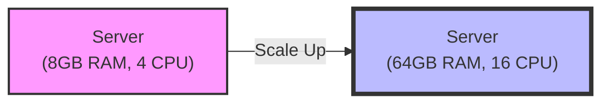
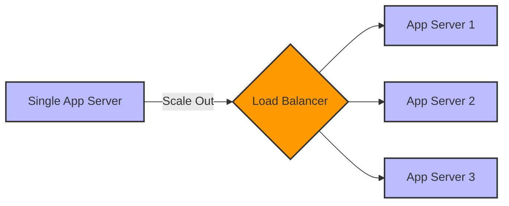

# <span style="color: #8E44AD">System Design</span>

## <span style="color: #2980B9">Single Server Setup Data Flow</span>
<span style="color: #E74C3C">**Note:**</span> Ideal for small user bases, struggles for heavy traffic.

.png>)

A single server setup is the most basic architecture where all components (web server, application, and database) run on a single machine. Here is how the data communication works:

1. <span style="color: #E74C3C">**Website Name (Domain Name):**</span> The user enters a human-readable website name (e.g., `www.example.com`) into their web browser.
2. <span style="color: #E74C3C">**DNS Server (Domain Name System):**</span> The browser doesn't know how to reach `www.example.com` directly. It queries a DNS Server, which acts like the internet's phonebook. The DNS server translates the human-readable domain name into an IP address.
3. <span style="color: #E74C3C">**IP Address (Internet Protocol):**</span> The DNS server responds with the IP address (e.g., `192.168.1.100`) associated with the domain. This IP address represents the exact location of the single server on the internet.
4. <span style="color: #E74C3C">**Data Communication (Request & Response):**</span>
   - <span style="color: #E74C3C">**Request:**</span> Now that the browser has the IP address, it sends an HTTP/HTTPS request directly to the single server over the internet.
   - <span style="color: #E74C3C">**Processing:**</span> The single server receives the request, processes it (which may involve reading from its local database or executing application logic), and prepares the data.
   - <span style="color: #E74C3C">**Response:**</span> Finally, the server sends back an HTTP/HTTPS response containing the requested resources (HTML, CSS, JavaScript, images) to the user's browser, and the website is rendered on the screen.

## <span style="color: #2980B9">Web Tier and Data Tier Separation</span>

.png>)

As the number of users increases, a single server will eventually run out of resources (CPU, RAM, Storage) and struggle to handle the heavy traffic. To resolve this, the single server architecture is divided into two distinct tiers:

1. <span style="color: #E74C3C">**Web Tier (Web/Application Server):**</span>
   - <span style="color: #E74C3C">**Role:**</span> This tier is responsible for handling incoming HTTP requests from the users' browsers, running the application's business logic, and serving web pages or API responses.
   - <span style="color: #E74C3C">**Advantage:**</span> By isolating the web server, you can efficiently handle more concurrent user requests. If traffic spikes, you can scale this tier independently without worrying about the database.

2. <span style="color: #E74C3C">**Data Tier (Database Server):**</span>
   - <span style="color: #E74C3C">**Role:**</span> This tier is strictly dedicated to storing, retrieving, and managing the application's data. It does not handle direct internet traffic.
   - <span style="color: #E74C3C">**Advantage:**</span> Database operations are often resource-heavy. Giving the database its own dedicated server prevents complex queries from slowing down the web server. It also improves security since the data tier can be placed in a private network, inaccessible directly from the internet.

### <span style="color: #D35400">Key Benefits of this Separation:</span>
- <span style="color: #E74C3C">**Independent Scaling:**</span> You can upgrade or add more web servers (for traffic) or upgrade the database server (for storage/compute) individually based on what is becoming the bottleneck.
- <span style="color: #E74C3C">**Better Performance:**</span> Each server uses its dedicated resources exclusively for its specific task, preventing them from competing for CPU or memory.
- <span style="color: #E74C3C">**Improved Security:**</span> The database is no longer directly exposed to the public internet; it only communicates with the trusted Web Tier.

## <span style="color: #2980B9">Choosing the Right Type of Database</span>
.png>)

When designing your Data Tier, selecting the appropriate database architecture is a critical decision. There are <span style="color: #E74C3C">**two main options**</span>:

### <span style="color: #D35400">1. Relational Databases (RDBMS)</span>
Relational databases are highly structured and organize data into predefined <span style="color: #E74C3C">**tables and rows**</span> with strict relationships between them.

- <span style="color: #E74C3C">**Key Characteristics:**</span> Ensures strong data consistency and is ideal for structured data and complex queries.
- <span style="color: #E74C3C">**Query Language:**</span> They use <span style="color: #E74C3C">**SQL (Structured Query Language)**</span> for finding and manipulating data.
- <span style="color: #E74C3C">**Examples:**</span> PostgreSQL, MySQL, SQLite, Oracle Database.

#### <span style="color: #27AE60">Advantages of RDBMS:</span>
- <span style="color: #E74C3C">**Complex Queries:**</span> They support complex <span style="color: #E74C3C">**JOIN operations**</span> across multiple tables, making it easy to fetch related data.
- <span style="color: #E74C3C">**Data Consistency & Integrity:**</span> They provide strict data integrity, especially important for transactions. Each transaction reliably follows the <span style="color: #E74C3C">**ACID**</span> properties:
  - <span style="color: #E74C3C">**A (Atomicity):**</span> Ensures that a transaction is treated as a single, indivisible unit. Either all operations within it succeed, or none do (all-or-nothing).
  - <span style="color: #E74C3C">**C (Consistency):**</span> Ensures the database transitions from one valid state to another. Any data written must follow the defined rules and constraints.
  - <span style="color: #E74C3C">**I (Isolation):**</span> Ensures that concurrent transactions execute independently without interfering with each other. The result is the same as if they were executed sequentially.
  - <span style="color: #E74C3C">**D (Durability):**</span> Ensures that once a transaction is committed, it remains permanently stored, even in the event of a system failure or crash.

### <span style="color: #D35400">2. Non-Relational Databases (NoSQL)</span>
NoSQL databases provide much more flexibility, as they do not require a fixed schema. They are heavily used to store, manage, and quickly access large amounts of <span style="color: #E74C3C">**unstructured or semi-structured data**</span>.

- <span style="color: #E74C3C">**Key Characteristics:**</span> Highly scalable, flexible data models, and excellent for rapid development.
- <span style="color: #E74C3C">**Different Forms of NoSQL:**</span>
  
  - <span style="color: #E74C3C">**Document Stores:**</span> Store data in JSON-like documents. Example: <span style="color: #E74C3C">**MongoDB**</span>
  .png>)
    ```mermaid
    classDiagram
        class Document1 {
            _id: "101"
            name: "Alice"
            age: "28"
            city: "NY"
        }
        class Document2 {
            _id: "102"
            name: "Bob"
            hobbies: "Reading, Gaming"
        }
    ```
    - <span style="color: #E74C3C">**Advantages:**</span> High schema flexibility, easy mapping to application objects, excellent for hierarchical data.
    - <span style="color: #E74C3C">**Disadvantages:**</span> Poor performance on complex joins across multiple documents, can lead to data duplication.

  - <span style="color: #E74C3C">**Wide-Column Stores:**</span> Store data in tables, rows, and dynamic columns. Example: <span style="color: #E74C3C">**Cassandra/Cosmos DB**</span>
  .png>)
    ```mermaid
    classDiagram
        class RowKey_User1 {
            name: "Alice"
            email: "alice@web.com"
        }
        class RowKey_User2 {
            name: "Bob"
            age: "32"
        }
    ```
    - <span style="color: #E74C3C">**Advantages:**</span> Extreme horizontal scalability, extremely fast write performance, built for high availability and big data.
    - <span style="color: #E74C3C">**Disadvantages:**</span> Poor at querying by anything other than the primary key, complex data modeling, not suited for complex aggregations.

  - <span style="color: #E74C3C">**Key-Value Stores:**</span> Store data as a collection of key-value pairs. Example: <span style="color: #E74C3C">**Redis/Memcached**</span>
  .png>)
    ```mermaid
    graph LR
        K1["Key: 'session:101'"] --> V1["Value: '{user: 1, active: true}'"]
        K2["Key: 'cart:55'"] --> V2["Value: '{item: laptop, qty: 1}'"]
    ```
    - <span style="color: #E74C3C">**Advantages:**</span> Blazing fast read/write speeds, very simple data model, highly scalable for caching and session management.
    - <span style="color: #E74C3C">**Disadvantages:**</span> Cannot query by the "value", lack of complex query capabilities, not designed for complex relationships.

  - <span style="color: #E74C3C">**Graph Databases:**</span> Store data in nodes and edges, focusing on relationships. Example: <span style="color: #E74C3C">**Neo4j**</span>
  .png>)
    ```mermaid
    graph LR
        A((Alice)) -- KNOWS --> B((Bob))
        A -- LIVES_IN --> C((New York))
        B -- WORKS_AT --> D((Tech Corp))
        D -- LOCATED_IN --> C
    ```
    - <span style="color: #E74C3C">**Advantages:**</span> Perfectly suited for highly interconnected data (social networks, fraud detection, recommendation engines), lightning-fast relationship traversals.
    - <span style="color: #E74C3C">**Disadvantages:**</span> Steeper learning curve (requires query languages like Cypher), harder to scale horizontally compared to other NoSQL databases, overkill for simple tabular data.

### <span style="color: #D35400">Summary Comparison of NoSQL Databases</span>

| NoSQL Type | Data Model | Key Strength | Main Limitation | Best Use Case (When to use) |
| :--- | :--- | :--- | :--- | :--- |
| <span style="color: #E74C3C">**Document Store**</span> | JSON/BSON Documents | Highly flexible schema, maps easily to code objects | Poor at complex joins and multi-document transactions | Content management, e-commerce catalogs, user profiles |
| <span style="color: #E74C3C">**Wide-Column Store**</span> | Tables with dynamic columns | Extreme write performance and horizontal scalability | Difficult to query by non-primary keys | Time-series data, IoT sensor data, massive logging systems |
| <span style="color: #E74C3C">**Key-Value Store**</span> | Key-Value pairs | Blazing fast read/write speeds, highly scalable | Cannot query by value, very limited query language | Caching (e.g., user sessions), leaderboards, real-time recommendations |
| <span style="color: #E74C3C">**Graph Database**</span> | Nodes and Edges | Lightning-fast complex relationship traversals | Harder to scale horizontally, steep learning curve | Social networks, fraud detection, recommendation engines |

---

## <span style="color: #2980B9">When to Choose Relational vs. Non-Relational</span>

### <span style="color: #D35400">Choose a Relational Database (RDBMS) when:</span>
1. <span style="color: #E74C3C">**Well-Structured Data & Clear Relationships:**</span> Your data is highly structured and entities have strict relationships.
   - *Example:* An e-commerce app tracking customers and orders.
2. <span style="color: #E74C3C">**Strong Consistency & Transactional Integrity:**</span> You require strict data integrity and cannot afford any anomalies (ACID compliance).
   - *Example:* A financial application or banking system.

### <span style="color: #D35400">Choose a Non-Relational Database (NoSQL) when:</span>
1. <span style="color: #E74C3C">**Super Low Latency:**</span> You need incredibly rapid, quick responses for read and write operations.
2. <span style="color: #E74C3C">**Unstructured & Semi-Structured Data:**</span> Your data does not fit into rigid tables and schemas frequently change.
3. <span style="color: #E74C3C">**Massive Data Volumes:**</span> You require highly scalable storage capable of handling massive amounts of traffic and data across distributed servers.

---

## <span style="color: #2980B9">Scaling the System: Vertical vs. Horizontal Scaling</span>

When your application starts receiving heavy traffic and your current server setup can no longer handle the load, you need to scale. There are two primary ways to scale a system: <span style="color: #E74C3C">**Vertical Scaling**</span> and <span style="color: #E74C3C">**Horizontal Scaling**</span>.

### <span style="color: #D35400">1. Vertical Scaling (Scale-Up)</span>
- <span style="color: #E74C3C">**Understanding the Content:**</span> Vertical scaling means adding more power (CPU, RAM, Storage, etc.) to your existing server. You are essentially making your single machine stronger.
- <span style="color: #E74C3C">**Example:**</span> Upgrading your server from 8GB of RAM and 4 CPUs to 64GB of RAM and 16 CPUs.



<span style="color: #E74C3C">**Advantages:**</span>
- Very simple to implement (usually no code changes required).
- Less complex administration and maintenance.
- Data consistency is naturally maintained since everything is in one place.

<span style="color: #E74C3C">**Disadvantages:**</span>
- <span style="color: #E74C3C">**Hardware Limits:**</span> There is a hard physical limit to how much you can upgrade a single machine.
- <span style="color: #E74C3C">**Single Point of Failure:**</span> If the server goes down, the entire application goes offline.
- <span style="color: #E74C3C">**Downtime:**</span> Upgrading hardware often requires taking the server offline temporarily.

### <span style="color: #D35400">2. Horizontal Scaling (Scale-Out)</span>
- <span style="color: #E74C3C">**Understanding the Content:**</span> Horizontal scaling means adding more servers into your pool of resources. Instead of making one server stronger, you add more servers to distribute the load using a Load Balancer.
- <span style="color: #E74C3C">**Example:**</span> Going from running your application on 1 server to running it simultaneously on 10 identical servers.



<span style="color: #E74C3C">**Advantages:**</span>
- <span style="color: #E74C3C">**Infinite Scalability:**</span> You can theoretically keep adding an endless number of servers.
- <span style="color: #E74C3C">**High Availability & Fault Tolerance:**</span> If one server crashes, the others can take over, preventing system downtime.
- <span style="color: #E74C3C">**No Downtime Scaling:**</span> You can add or remove servers dynamically without taking the system offline.

<span style="color: #E74C3C">**Disadvantages:**</span>
- Highly complex to implement and manage.
- Requires software architecture changes (e.g., making applications stateless, implementing distributed caching).
- Data consistency becomes much harder to maintain across multiple servers.

### <span style="color: #D35400">Summary Comparison Table</span>

| Feature | Vertical Scaling (Scale-Up) | Horizontal Scaling (Scale-Out) |
| :--- | :--- | :--- |
| <span style="color: #E74C3C">**Definition**</span> | Adding more resources (CPU/RAM) to an existing server | Adding more servers to the existing resource pool |
| <span style="color: #E74C3C">**Complexity**</span> | Simple | Highly Complex |
| <span style="color: #E74C3C">**Limits**</span> | Hard hardware limits (cannot scale infinitely) | Practically infinite scalability |
| <span style="color: #E74C3C">**Single Point of Failure**</span>| Yes (If the server dies, the app dies) | No (Built-in redundancy and high availability) |
| <span style="color: #E74C3C">**Downtime**</span> | Often requires downtime to upgrade hardware | Zero downtime (servers can be added dynamically) |
| <span style="color: #E74C3C">**Cost**</span> | High-end hardware can be very expensive | Uses cheaper, standard commodity hardware |

### <span style="color: #D35400">When to Use Which? (Scenarios)</span>

#### <span style="color: #27AE60">Use Vertical Scaling when:</span>
- <span style="color: #E74C3C">**Small to Medium Applications:**</span> You have a small engineering team and want the easiest way to handle moderate growth quickly without rewriting code.
- <span style="color: #E74C3C">**Traditional Relational Databases:**</span> SQL databases (RDBMS) are notoriously difficult to scale horizontally, so they are typically scaled vertically first.

#### <span style="color: #27AE60">Use Horizontal Scaling when:</span>
- <span style="color: #E74C3C">**Large-Scale Applications:**</span> You anticipate massive traffic that no single machine could ever handle (e.g., global social media or e-commerce platforms).
- <span style="color: #E74C3C">**Stateless Web Services:**</span> If your web/application servers don't store local user session data, they can easily be scaled horizontally to handle sudden traffic spikes dynamically.
