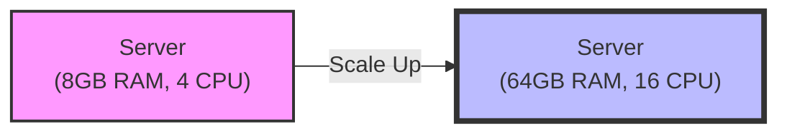
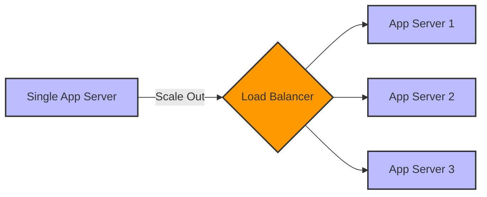

# System Design

## Single Server Setup Data Flow
**Note:** Ideal for small user bases, struggles for heavy traffic.

.png>)

A single server setup is the most basic architecture where all components (web server, application, and database) run on a single machine. Here is how the data communication works:

1. **Website Name (Domain Name):** The user enters a human-readable website name (e.g., `www.example.com`) into their web browser.
2. **DNS Server (Domain Name System):** The browser doesn't know how to reach `www.example.com` directly. It queries a DNS Server, which acts like the internet's phonebook. The DNS server translates the human-readable domain name into an IP address.
3. **IP Address (Internet Protocol):** The DNS server responds with the IP address (e.g., `192.168.1.100`) associated with the domain. This IP address represents the exact location of the single server on the internet.
4. **Data Communication (Request & Response):**
   - **Request:** Now that the browser has the IP address, it sends an HTTP/HTTPS request directly to the single server over the internet.
   - **Processing:** The single server receives the request, processes it (which may involve reading from its local database or executing application logic), and prepares the data.
   - **Response:** Finally, the server sends back an HTTP/HTTPS response containing the requested resources (HTML, CSS, JavaScript, images) to the user's browser, and the website is rendered on the screen.

## Web Tier and Data Tier Separation

.png>)

As the number of users increases, a single server will eventually run out of resources (CPU, RAM, Storage) and struggle to handle the heavy traffic. To resolve this, the single server architecture is divided into two distinct tiers:

1. **Web Tier (Web/Application Server):**
   - **Role:** This tier is responsible for handling incoming HTTP requests from the users' browsers, running the application's business logic, and serving web pages or API responses.
   - **Advantage:** By isolating the web server, you can efficiently handle more concurrent user requests. If traffic spikes, you can scale this tier independently without worrying about the database.

2. **Data Tier (Database Server):**
   - **Role:** This tier is strictly dedicated to storing, retrieving, and managing the application's data. It does not handle direct internet traffic.
   - **Advantage:** Database operations are often resource-heavy. Giving the database its own dedicated server prevents complex queries from slowing down the web server. It also improves security since the data tier can be placed in a private network, inaccessible directly from the internet.

### Key Benefits of this Separation:
- **Independent Scaling:** You can upgrade or add more web servers (for traffic) or upgrade the database server (for storage/compute) individually based on what is becoming the bottleneck.
- **Better Performance:** Each server uses its dedicated resources exclusively for its specific task, preventing them from competing for CPU or memory.
- **Improved Security:** The database is no longer directly exposed to the public internet; it only communicates with the trusted Web Tier.

## Choosing the Right Type of Database
.png>)

When designing your Data Tier, selecting the appropriate database architecture is a critical decision. There are **two main options**:

### 1. Relational Databases (RDBMS)
Relational databases are highly structured and organize data into predefined **tables and rows** with strict relationships between them.

- **Key Characteristics:** Ensures strong data consistency and is ideal for structured data and complex queries.
- **Query Language:** They use **SQL (Structured Query Language)** for finding and manipulating data.
- **Examples:** PostgreSQL, MySQL, SQLite, Oracle Database.

#### Advantages of RDBMS:
- **Complex Queries:** They support complex **JOIN operations** across multiple tables, making it easy to fetch related data.
- **Data Consistency & Integrity:** They provide strict data integrity, especially important for transactions. Each transaction reliably follows the **ACID** properties:
  - **A (Atomicity):** Ensures that a transaction is treated as a single, indivisible unit. Either all operations within it succeed, or none do (all-or-nothing).
  - **C (Consistency):** Ensures the database transitions from one valid state to another. Any data written must follow the defined rules and constraints.
  - **I (Isolation):** Ensures that concurrent transactions execute independently without interfering with each other. The result is the same as if they were executed sequentially.
  - **D (Durability):** Ensures that once a transaction is committed, it remains permanently stored, even in the event of a system failure or crash.

### 2. Non-Relational Databases (NoSQL)
NoSQL databases provide much more flexibility, as they do not require a fixed schema. They are heavily used to store, manage, and quickly access large amounts of **unstructured or semi-structured data**.

- **Key Characteristics:** Highly scalable, flexible data models, and excellent for rapid development.
- **Different Forms of NoSQL:**
  
  - **Document Stores:** Store data in JSON-like documents. Example: **MongoDB**
  .png>)
    ```mermaid
    classDiagram
        class Document1 {
            _id: "101"
            name: "Alice"
            age: "28"
            city: "NY"
        }
        class Document2 {
            _id: "102"
            name: "Bob"
            hobbies: "Reading, Gaming"
        }
    ```
    - **Advantages:** High schema flexibility, easy mapping to application objects, excellent for hierarchical data.
    - **Disadvantages:** Poor performance on complex joins across multiple documents, can lead to data duplication.

  - **Wide-Column Stores:** Store data in tables, rows, and dynamic columns. Example: **Cassandra/Cosmos DB**
  .png>)
    ```mermaid
    classDiagram
        class RowKey_User1 {
            name: "Alice"
            email: "alice@web.com"
        }
        class RowKey_User2 {
            name: "Bob"
            age: "32"
        }
    ```
    - **Advantages:** Extreme horizontal scalability, extremely fast write performance, built for high availability and big data.
    - **Disadvantages:** Poor at querying by anything other than the primary key, complex data modeling, not suited for complex aggregations.

  - **Key-Value Stores:** Store data as a collection of key-value pairs. Example: **Redis/Memcached**
  .png>)
    ```mermaid
    graph LR
        K1["Key: 'session:101'"] --> V1["Value: '{user: 1, active: true}'"]
        K2["Key: 'cart:55'"] --> V2["Value: '{item: laptop, qty: 1}'"]
    ```
    - **Advantages:** Blazing fast read/write speeds, very simple data model, highly scalable for caching and session management.
    - **Disadvantages:** Cannot query by the "value", lack of complex query capabilities, not designed for complex relationships.

  - **Graph Databases:** Store data in nodes and edges, focusing on relationships. Example: **Neo4j**
  .png>)
    ```mermaid
    graph LR
        A((Alice)) -- KNOWS --> B((Bob))
        A -- LIVES_IN --> C((New York))
        B -- WORKS_AT --> D((Tech Corp))
        D -- LOCATED_IN --> C
    ```
    - **Advantages:** Perfectly suited for highly interconnected data (social networks, fraud detection, recommendation engines), lightning-fast relationship traversals.
    - **Disadvantages:** Steeper learning curve (requires query languages like Cypher), harder to scale horizontally compared to other NoSQL databases, overkill for simple tabular data.

### Summary Comparison of NoSQL Databases

| NoSQL Type | Data Model | Key Strength | Main Limitation | Best Use Case (When to use) |
| :--- | :--- | :--- | :--- | :--- |
| **Document Store** | JSON/BSON Documents | Highly flexible schema, maps easily to code objects | Poor at complex joins and multi-document transactions | Content management, e-commerce catalogs, user profiles |
| **Wide-Column Store** | Tables with dynamic columns | Extreme write performance and horizontal scalability | Difficult to query by non-primary keys | Time-series data, IoT sensor data, massive logging systems |
| **Key-Value Store** | Key-Value pairs | Blazing fast read/write speeds, highly scalable | Cannot query by value, very limited query language | Caching (e.g., user sessions), leaderboards, real-time recommendations |
| **Graph Database** | Nodes and Edges | Lightning-fast complex relationship traversals | Harder to scale horizontally, steep learning curve | Social networks, fraud detection, recommendation engines |

---

## When to Choose Relational vs. Non-Relational

### Choose a Relational Database (RDBMS) when:
1. **Well-Structured Data & Clear Relationships:** Your data is highly structured and entities have strict relationships.
   - *Example:* An e-commerce app tracking customers and orders.
2. **Strong Consistency & Transactional Integrity:** You require strict data integrity and cannot afford any anomalies (ACID compliance).
   - *Example:* A financial application or banking system.

### Choose a Non-Relational Database (NoSQL) when:
1. **Super Low Latency:** You need incredibly rapid, quick responses for read and write operations.
2. **Unstructured & Semi-Structured Data:** Your data does not fit into rigid tables and schemas frequently change.
3. **Massive Data Volumes:** You require highly scalable storage capable of handling massive amounts of traffic and data across distributed servers.

---

## Scaling the System: Vertical vs. Horizontal Scaling

When your application starts receiving heavy traffic and your current server setup can no longer handle the load, you need to scale. There are two primary ways to scale a system: **Vertical Scaling** and **Horizontal Scaling**.

### 1. Vertical Scaling (Scale-Up)
- **Understanding the Content:** Vertical scaling means adding more power (CPU, RAM, Storage, etc.) to your existing server. You are essentially making your single machine stronger.
- **Example:** Upgrading your server from 8GB of RAM and 4 CPUs to 64GB of RAM and 16 CPUs.



**Advantages:**
- Very simple to implement (usually no code changes required).
- Less complex administration and maintenance.
- Data consistency is naturally maintained since everything is in one place.

**Disadvantages:**
- **Hardware Limits:** There is a hard physical limit to how much you can upgrade a single machine.
- **Single Point of Failure:** If the server goes down, the entire application goes offline.
- **Downtime:** Upgrading hardware often requires taking the server offline temporarily.

### 2. Horizontal Scaling (Scale-Out)
- **Understanding the Content:** Horizontal scaling means adding more servers into your pool of resources. Instead of making one server stronger, you add more servers to distribute the load using a Load Balancer.
- **Example:** Going from running your application on 1 server to running it simultaneously on 10 identical servers.



**Advantages:**
- **Infinite Scalability:** You can theoretically keep adding an endless number of servers.
- **High Availability & Fault Tolerance:** If one server crashes, the others can take over, preventing system downtime.
- **No Downtime Scaling:** You can add or remove servers dynamically without taking the system offline.

**Disadvantages:**
- Highly complex to implement and manage.
- Requires software architecture changes (e.g., making applications stateless, implementing distributed caching).
- Data consistency becomes much harder to maintain across multiple servers.

### Summary Comparison Table

| Feature | Vertical Scaling (Scale-Up) | Horizontal Scaling (Scale-Out) |
| :--- | :--- | :--- |
| **Definition** | Adding more resources (CPU/RAM) to an existing server | Adding more servers to the existing resource pool |
| **Complexity** | Simple | Highly Complex |
| **Limits** | Hard hardware limits (cannot scale infinitely) | Practically infinite scalability |
| **Single Point of Failure**| Yes (If the server dies, the app dies) | No (Built-in redundancy and high availability) |
| **Downtime** | Often requires downtime to upgrade hardware | Zero downtime (servers can be added dynamically) |
| **Cost** | High-end hardware can be very expensive | Uses cheaper, standard commodity hardware |

### When to Use Which? (Scenarios)

#### Use Vertical Scaling when:
- **Small to Medium Applications:** You have a small engineering team and want the easiest way to handle moderate growth quickly without rewriting code.
- **Traditional Relational Databases:** SQL databases (RDBMS) are notoriously difficult to scale horizontally, so they are typically scaled vertically first.

#### Use Horizontal Scaling when:
- **Large-Scale Applications:** You anticipate massive traffic that no single machine could ever handle (e.g., global social media or e-commerce platforms).
- **Stateless Web Services:** If your web/application servers don't store local user session data, they can easily be scaled horizontally to handle sudden traffic spikes dynamically.

---

## Load Balancers

A **Load Balancer** distributes incoming network traffic across multiple servers. This ensures that no single server bears too much load, which improves overall application responsiveness and availability.

### 7 Strategies and Algorithms Used in Load Balancing:

#### 1. Round Robin
- **Description:** The simplest algorithm. It routes each incoming request to the next server in the line, cycling through the list of servers in order.
- **Workflow:** Request 1 goes to Server A, Request 2 goes to Server B, Request 3 goes to Server C, Request 4 goes back to Server A, and so on.
- **Advantages:** Extremely simple to implement; ensures a mathematically even distribution of requests.
- **Disadvantages:** Does not account for server health, current load, or capacity. Can easily overload a server that gets stuck processing heavy requests.

#### 2. Least Connection
- **Description:** Routes traffic to the server with the fewest active connections at the time the request is received.
- **Workflow:** When a new request arrives, the load balancer checks the active connection count for all servers. If Server A has 50 connections and Server B has 10, the load balancer sends the new request to Server B.
- **Advantages:** Highly efficient at balancing actual load, preventing individual servers from getting overwhelmed.
- **Disadvantages:** Requires the load balancer to constantly compute and track connection states, adding slight overhead.

#### 3. Least Response Time
- **Description:** Directs traffic to the server with the fewest active connections *and* the lowest average response time.
- **Workflow:** The load balancer monitors how quickly each server responds. It combines this speed metric with the active connection count to find the currently "fastest" and "most available" server, routing the next request there.
- **Advantages:** Excellent for ensuring fast user experiences; automatically shifts traffic away from slow or struggling servers.
- **Disadvantages:** More complex to compute; temporary network hiccups can heavily skew response time metrics.

#### 4. IP Hash
- **Description:** Uses a mathematical function (hashing) on the client's IP address to determine which server receives the request.
- **Workflow:** The user's IP (e.g., `192.168.1.5`) is hashed into a number. That number dictates the server choice. Because the hash function is consistent, the same IP address will *always* be routed to the same server (great for sticky sessions).
- **Advantages:** Guarantees session persistence (sticky sessions) because a specific user always hits the same server.
- **Disadvantages:** Can lead to uneven load distribution if a large group of users originates from the same IP network (e.g., a corporate office).

#### 5. Weighted Algorithm (Weighted Round Robin)
- **Description:** Allows administrators to assign a "weight" (priority or capacity value) to each server based on its hardware capabilities.
- **Workflow:** If Server A is twice as powerful as Server B, it is given a Weight of 2. The load balancer will then send two requests to Server A for every one request it sends to Server B.
- **Advantages:** Maximizes resource utilization by intentionally sending more traffic to more powerful hardware.
- **Disadvantages:** Requires manual configuration and constant tweaking of weights if server specs change.

#### 6. Geographic Routing Algorithm
- **Description:** Distributes requests based on the physical, geographical location of the user making the request. *(Note: Often what is meant by "graphical" routing).*
- **Workflow:** A user in Tokyo makes a request. The load balancer detects the location via their IP address and routes the request to the data center physically located in Japan, rather than sending it to a server in New York.
- **Advantages:** Drastically reduces network latency for global users and helps comply with strict regional data residency laws.
- **Disadvantages:** Highly complex to set up; relies heavily on accurate DNS resolution and GeoIP databases.

#### 7. Consistent Hashing
- **Description:** An advanced hashing technique that minimizes the redistribution of traffic when servers are added or removed from the cluster.
- **Workflow:** Servers and incoming requests are mapped onto a circular "hash ring". A request is routed to the first server it encounters moving clockwise on the ring. If a server goes down, only the traffic meant for that specific server gets reassigned to the next one, leaving the rest of the network's traffic untouched.
- **Advantages:** Extremely resilient to scaling events; adding or removing nodes only affects a tiny fraction of user sessions.
- **Disadvantages:** Harder to implement properly; not strictly necessary unless operating at massive scale or dealing with distributed caching.

### Summary Comparison of Load Balancing Algorithms

| Algorithm | Key Characteristic | Main Advantage | Main Disadvantage |
| :--- | :--- | :--- | :--- |
| **Round Robin** | Cycles requests sequentially | Simple to implement | Ignores server load and health |
| **Least Connection** | Routes to fewest active connections | Prevents server overload | Requires connection tracking overhead |
| **Least Response Time** | Routes to fastest responding server | Optimizes for user speed | Complex to calculate accurately |
| **IP Hash** | Hashes client IP to assign server | Ensures session persistence | Can cause uneven load distribution |
| **Weighted Algorithm** | Prioritizes servers based on specs | Maximizes powerful hardware | Requires manual weight configuration |
| **Geographic Routing** | Routes based on physical location | Minimizes global network latency | Requires complex GeoIP setup |
| **Consistent Hashing** | Uses a hash ring for assignments | Seamless scaling with minimal disruption | Complex to implement, overkill for small setups |

---

### Popular Load Balancing Solutions

| Category | Solution | Key Features / Notes |
| :--- | :--- | :--- |
| **Software** | **Nginx** | High performance, versatile; includes built-in **health checks** to monitor server status. |
| | **HAProxy** | Reliable, high-performance TCP/HTTP load balancer; widely used for its efficiency. |
| **Hardware** | **F5 BIG-IP** | Enterprise-grade hardware load balancer with advanced security and traffic management. |
| | **Citrix ADC** | Scalable application delivery controller (formerly NetScaler) for high-availability environments. |
| **Cloud** | **AWS Elastic Load Balancing (ELB)** | Fully managed load balancing for AWS environments (ALB, NLB, GLB). |
| | **Azure Load Balancer** | Layer-4 load balancer for high availability in Microsoft Azure. |
| | **Google Cloud Load Balancing** | Scalable, software-defined load balancing for Google Cloud Platform. |

---

### Single point of Failure

**Single Point of Failure (SPOF)** refers to a component, process, or device in a system that, if it fails, will cause the entire system or application to fail. In a high-availability or fault-tolerant system, the goal is to eliminate SPOFs to ensure continuous operation even if individual components fail.

.png>)

#### Critical Examples of SPOFs in Distributed Systems

While architectural scaling improves performance, it can inadvertently introduce new bottlenecks if high availability is not baked into every tier.

##### 1. The Monolithic Database (Data Tier SPOF)
In many early-stage architectures, while the Web Tier is scaled horizontally, the **Data Tier** remains a single, centralized instance.
- **The Technical Risk:** A single database server represents a catastrophic point of failure. Whether it's a hardware crash, a targeted SQL-based attack, or a resource-exhaustion DDoS, if the database becomes unresponsive, the system's "source of truth" disappears.
- **System Impact:** Even with dozens of healthy application servers, the system cannot process requests that require data persistence or retrieval. This results in a **Total System Outage** where users see generic error pages.
- **Professional Mitigation:** Implement **Database Replication** (Primary-Replica or Multi-Primary) and automated **Failover mechanisms**. This ensures that if the primary node fails, a standby node can immediately take over traffic.

##### 2. The Traffic Orchestrator (Load Balancer SPOF)
A Load Balancer is designed to protect the system from individual server failures, but if only one Load Balancer is deployed, it becomes the ultimate bottleneck.
- **The Technical Risk:** If the Load Balancer is the sole entry point for all incoming traffic, it is a high-value target. A hardware failure, network misconfiguration, or a massive DDoS attack on the Load Balancer's IP will sever all connections between your users and your infrastructure.
- **System Impact:** This creates a "Black Hole" effect. Despite having a fully functional backend of 100+ servers, your application becomes **unreachable**, making it appear as if the entire platform is down.
- **Professional Mitigation:** Deploy **Redundant Load Balancers** in an **Active-Passive** or **Active-Active** configuration. Utilizing **Floating IPs (Virtual IPs)** or DNS-based Global Server Load Balancing (GSLB) ensures that if one orchestrator fails, traffic is seamlessly rerouted through a healthy peer.

---

### Strategies for Eliminating Single Points of Failure (SPOFs)

To build a truly resilient system, architects must move beyond simple scaling and implement comprehensive **High Availability (HA)** strategies. Below are the standard industry patterns for ensuring system uptime.

#### 1. High Availability through Redundancy
.png>)
The foundation of a fault-tolerant system is the elimination of "lonely" components. This is achieved by deploying multiple instances of critical infrastructure.
- **Active-Passive Configuration:** A primary load balancer handles all traffic, while a secondary "standby" node remains idle. If the primary fails, a **Virtual IP (VIP)** or **Floating IP** is instantly remapped to the secondary node using protocols like **Keepalived** or **VRRP**.
- **Active-Active Configuration:** Multiple load balancers operate simultaneously, sharing the total traffic load. If one node fails, the remaining nodes automatically absorb its traffic, ensuring zero downtime and optimized resource utilization.

#### 2. Comprehensive Health Monitoring
.png>)
Monitoring must extend beyond the application layer to include the infrastructure orchestrators themselves.
- **External Heartbeats:** Use external monitoring services (e.g., AWS CloudWatch, Datadog, or Prometheus) to perform constant "heartbeat" checks on the load balancers and the network path.
- **Automated Failover Triggers:** When a monitoring agent detects that a load balancer is unresponsive or failing health checks, it can automatically trigger a DNS record update or a network routing change to bypass the faulty node.

#### 3. Self-Healing Infrastructure
.png>)
Modern distributed systems prioritize **Resilience by Design** through automated recovery and orchestration.
- **Auto-Scaling & Auto-Provisioning:** By utilizing cloud-native services like **AWS Auto Scaling Groups** or **Kubernetes Controllers**, the system can automatically detect the loss of a node.
- **Automated Instance Replacement:** Instead of requiring manual intervention, the platform terminates the unhealthy instance and immediately provisions a fresh, pre-configured load balancer from a standard image (AMI or Container). This ensures the system "heals" itself back to its target state within seconds, minimizing the window of vulnerability.

---

## API (Application Programming Interface)

An **API (Application Programming Interface)** is a set of defined rules and protocols that allow different software applications to communicate and exchange data with each other. In modern system design, APIs serve as the "connective tissue" between decoupled services, enabling them to work together as a unified platform.

### What is an API? (The Technical Definition)
At its core, an API acts as a formal contract between a **provider** (the server) and a **consumer** (the client). It abstracts the underlying complexity of the system, allowing developers to interact with services without needing to understand their internal code or database structure.

#### The Request-Response Cycle
Communication through an API typically follows a structured cycle:
1. **Request:** The client sends a structured message to an endpoint (e.g., `GET /v1/users/101`).
2. **Processing:** The server validates the request, checks for authorization, executes business logic, and retrieves data from the Data Tier.
3. **Response:** The server returns an HTTP status code (e.g., `200 OK`) along with the requested payload, usually formatted as **JSON** or **XML**.

---

### Core Components of an API Interaction
To design or consume APIs effectively, developers must master these four primary components:

| Component | Description | Example |
| :--- | :--- | :--- |
| **Endpoint** | The specific URL or address where the API resource resides. | `https://api.myapp.com/v1/orders` |
| **HTTP Method** | The verb that defines the type of action to be performed. | `GET` (Read), `POST` (Create), `DELETE` (Remove) |
| **Headers** | Metadata providing context about the request or the client. | `Authorization: Bearer <token>`, `Content-Type: application/json` |
| **Body (Payload)** | The actual data sent to the server (usually for creation or updates). | `{"product_id": 55, "quantity": 2}` |

---

### Popular API Architectures

.png>)

#### 1. REST (Representational State Transfer)
The most widely used architecture for web services. It is based on standard HTTP protocols and emphasizes **statelessness**, where each request contains all the information needed to fulfill it.

##### Understanding "Resource-Based" Design
In REST, everything is treated as a **Resource**. A resource is any object, data, or service that can be accessed by a client (e.g., a User, an Order, or a Product).

- **The URI as an Identity:** Every resource is identified by a unique **URI (Uniform Resource Identifier)**. Instead of calling a function like `getUser(id)`, you access a path that represents the user entity.
- **Nouns vs. Verbs:** RESTful URIs should always use **nouns** to represent resources, never verbs. The action to be performed is determined by the **HTTP Method** (the verb), not the URL.

| Action | Professional REST (Resource-Based) | Unprofessional (Action-Based) |
| :--- | :--- | :--- |
| **Get all users** | `GET /users` | `GET /getAllUsers` |
| **Get a specific user** | `GET /users/123` | `GET /getUser?id=123` |
| **Create a user** | `POST /users` | `POST /createUser` |
| **Delete a user** | `DELETE /users/123` | `POST /deleteUser/123` |

##### Collections and Sub-Resources
Resources can be grouped into collections or nested to show relationships:
- **Collection:** `/products` refers to the entire list of products.
- **Individual Resource:** `/products/55` refers to a specific product.
- **Sub-Resource:** `/users/123/orders` refers to all orders belonging to user 123.

##### Understanding "Statelessness"
In a **Stateless** architecture, the server does not store any information about the client's state or previous interactions. Each request from a client to a server must be "self-contained."

- **Self-Contained Requests:** Every single request must include all the information the server needs to process it—including authentication tokens, parameters, and the desired action. The server doesn't "remember" that you logged in during the previous request.
- **Authentication via Tokens:** Because the server is stateless, it doesn't use traditional server-side sessions. Instead, clients typically send an **Authorization Header** (e.g., a **JWT** or **Bearer Token**) with every single request to prove their identity.
- **Impact on Scalability:** Statelessness is a key reason why REST APIs are so scalable. Since any server in a pool can handle any request (because no session data is stored locally), you can add or remove servers behind a load balancer without ever worrying about "session stickiness" or synchronizing user data across nodes.

#### 2. GraphQL
Developed by Meta, GraphQL allows clients to request exactly the data they need and nothing more. This eliminates "over-fetching" and is ideal for complex systems with deeply nested data relationships.

#### 3. gRPC (Google Remote Procedure Call)
A high-performance framework that uses **Protocol Buffers** (a binary serialization format) instead of JSON. It is primarily used for lightning-fast communication between microservices.

#### 4. Webhooks
Often called "Reverse APIs," webhooks allow a server to push real-time data to a client automatically when a specific event occurs (e.g., a payment is completed), rather than the client constantly polling the server for updates.
